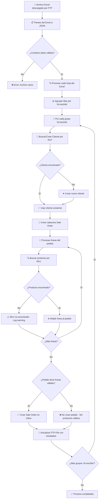

# Odoo 16 Field Service & FTP Integration Platform

This project provides a Docker-based Odoo 16 environment with comprehensive Field Service Management capabilities and custom FTP automation for Excel file processing.

## Project Structure

```
addon-ftp/
├── docker-compose.yml          # Docker orchestration
├── .env                        # Environment variables
├── config/
│   └── odoo.conf              # Odoo configuration
├── addons/                    # All Odoo addons
│   ├── ftp_cuenta_cliente/    # Custom FTP addon
│   ├── fieldservice/          # Core FSM module
│   ├── fieldservice_*/        # FSM extensions (22 modules)
│   ├── extra_fields_ubicaciones/  # Stock location enhancements
│   ├── stock_picking_to_batch_group_fields/  # Batch picking
│   └── web_domain_field/      # Web UI enhancements
└── README.md                  # This file
```

## Quick Start

1. **Start the services:**
   ```bash
   docker compose up -d
   ```

2. **Fix Python dependencies (if fresh install):**
   ```bash
   docker exec addon-ftp-web-1 pip uninstall -y numpy pandas bcrypt PyNaCl
   docker exec addon-ftp-web-1 pip install numpy==1.24.3 pandas==2.0.3 bcrypt PyNaCl
   ```

3. **Access Odoo:**
   - URL: http://localhost:8069
   - Database: odoo
   - Username: admin
   - Password: admin

4. **Modules Status:**
   - ✅ 20 modules already installed and active
   - Main menus: Field Service, FTP Cuenta Cliente, Sales, Project
   - All Field Service features are operational

## Services

### Odoo Web Service
- **Image:** odoo:16
- **Port:** 8069
- **Volumes:** 
  - `./addons:/mnt/extra-addons` (Custom addons)
  - `./config:/etc/odoo` (Configuration)

### PostgreSQL Database
- **Image:** postgres:15
- **Port:** 5432
- **Database:** odoo
- **User:** odoo
- **Password:** odoo

## Available Addons

### ✅ Installed Modules (20 modules active)

#### 🔧 Field Service Management Suite (18 modules)
- **fieldservice** (v16.0.1.9.0): Core FSM system ✅
- **fieldservice_account**: Invoice tracking ✅
- **fieldservice_account_analytic**: Analytic accounting ✅
- **fieldservice_activity**: Activity checklists ✅
- **fieldservice_calendar**: Calendar integration ✅
- **fieldservice_crm**: CRM integration ✅
- **fieldservice_isp_account**: ISP billing ✅
- **fieldservice_isp_flow**: ISP workflows ✅
- **fieldservice_portal**: Customer portal ✅
- **fieldservice_project**: Project integration ✅
- **fieldservice_recurring**: Recurring orders ✅
- **fieldservice_route**: Route planning ✅
- **fieldservice_sale**: Sales integration ✅
- **fieldservice_size**: Size management ✅
- **fieldservice_skill**: Skills management ✅
- **fieldservice_stage_validation**: Stage validation ✅
- **fieldservice_vehicle**: Vehicle management ✅

#### 🌐 Other Active Modules
- **web_domain_field**: Advanced filtering ✅
- **ftp_cuenta_cliente**: FTP/Excel processing ✅

### ⏳ Available but Not Installed
- **fieldservice_equipment_stock**: Equipment inventory (requires additional dependencies)
- **fieldservice_geoengine**: Geographic mapping (requires base_geoengine)
- **fieldservice_stock**: Inventory movements (requires additional stock modules)
- **fieldservice_stock_request**: Stock requests (requires stock_request modules)
- **fieldservice_timeline**: Timeline view (requires web_timeline)
- **extra_fields_ubicaciones**: Stock location fields
- **stock_picking_to_batch_group_fields**: Batch picking (requires stock_picking_batch)

## FTP Addon Features

### Multi-Protocol Support
- **FTP**: Standard File Transfer Protocol
- **FTPS**: FTP with TLS/SSL encryption
- **SFTP**: SSH File Transfer Protocol
- **SCP**: Secure Copy Protocol over SSH

### Core Functionality
- ✅ Configurable FTP/SFTP/SCP connections via web interface
- ✅ Scheduled cron jobs for automatic file processing
- ✅ Excel file download and parsing (.xlsx, .xls)
- ✅ JSON content storage with metadata
- ✅ Automatic file organization (move processed files)
- ✅ Connection testing and status monitoring
- ✅ Detailed logging and error handling

### File Processing
- Downloads Excel files from configured FTP path (`/` by default)
- Parses Excel content using first row as JSON keys
- Stores file metadata (name, size, content) in database
- **Creates Sale Orders** from Excel data (optional)
- Moves processed files to designated folder (`/files_read`)

### Sale Order Creation
The addon can automatically create Odoo sale orders from Excel files through the **Sale Order Processor** module.

## Configuration

### Environment Variables (.env)
```env
POSTGRES_DB=odoo
POSTGRES_USER=odoo
POSTGRES_PASSWORD=odoo
```

### FTP Configuration
Access via: **FTP Cuenta Cliente > FTP Configurations**

Required fields:
- **Name**: Configuration identifier
- **Host**: FTP server address
- **Username/Password**: Authentication credentials
- **Connection Type**: FTP, FTPS, SFTP, or SCP
- **Paths**: Download and processed file paths
- **Scheduling**: Cron interval in minutes

## Usage

### 1. Create FTP Configuration
```
Menu: FTP Cuenta Cliente > FTP Configurations
- Click "Create"
- Fill in server details
- Test connection
- Save configuration
```

### 2. Manual File Processing
```
- Open FTP configuration
- Click "Process Files Now"
- Check "Processed Files" menu for results
```

### 3. View Processed Files
```
Menu: FTP Cuenta Cliente > Processed Files
- View file metadata
- Check JSON content
- Monitor processing status
```

### 4. Create Sale Orders from Excel
```
Menu: FTP Cuenta Cliente > Processed Files
- Select a processed file
- Click "Create Sale Orders" button
- Review processing logs and created orders
```

## 📊 Sale Order Creation Flow

### Diagrama del Proceso de Creación de Sale Orders



## 📋 Mapeo de Columnas Excel → Sale Order

### Estructura del Archivo Excel
El archivo Excel debe tener la **primera fila como cabeceras** que actúan como claves JSON.

### Mapeo de Campos

| **Campo Excel** | **Campo Odoo (sale.order)** | **Descripción** | **Requerido** |
|-----------------|----------------------------|-----------------|---------------|
| `id.mochila` | `client_order_ref` | Identificador único para agrupar productos en una orden | ✅ **Sí** |
| `rut` | `partner_id` (búsqueda/creación en res.partner) | RUT del cliente para búsqueda/creación | ❌ No |
| `proveedor` | `partner_id.name` | Nombre del cliente (si se crea nuevo) | ❌ No |
| `tecnico` | `note` | Información del técnico asignado | ❌ No |
| `fecha.agenda` | `note` | Fecha programada para la orden | ❌ No |
| `region` | `note` | Región del servicio | ❌ No |
| `bodega` | `note` | Bodega asignada | ❌ No |
| `codigo.iata` | `note` | Código IATA (aeroportos) | ❌ No |
| `comentario` | `note` | Comentarios adicionales | ❌ No |

### Mapeo de Líneas de Pedido (sale.order.line)

| **Campo Excel** | **Campo Odoo** | **Descripción** | **Requerido** |
|-----------------|----------------|-----------------|---------------|
| `sku` | `product_id` (búsqueda por default_code) | Código SKU del producto | ✅ **Sí** |
| `cantidad` | `product_uom_qty` | Cantidad del producto | ❌ No (default: 1) |
| `descripcion` | Solo para logs | Descripción del producto (no se almacena) | ❌ No |

### Campos de Auditoría y Control

| **Campo Excel** | **Uso en Sistema** | **Descripción** |
|-----------------|-------------------|-----------------|
| Todas las columnas | `ftp.file.processing_log` | Log detallado de procesamiento por fila |
| SKUs no encontrados | `ftp.file.error_message` | Lista de SKUs no encontrados en catálogo |
| Conteo | `ftp.file.sale_orders_created` | Número de órdenes creadas exitosamente |

## 🔄 Proceso Detallado de Creación de Valores

### 1. Creación/Búsqueda de Cliente (res.partner)

**Lógica de creación:**
```python
# Buscar cliente existente por RUT
partner = env['res.partner'].search([('vat', '=', rut)], limit=1)

if not partner:
    # Crear nuevo cliente
    partner_vals = {
        'name': data.get('proveedor', '') or f"Customer {rut}",
        'vat': rut,
        'customer_rank': 1,
        'comment': f"Created from FTP import - Technician: {data.get('tecnico', '')}"
    }
    partner = env['res.partner'].create(partner_vals)
```

### 2. Creación de Sale Order

**Valores por defecto:**
```python
order_vals = {
    'partner_id': partner.id,
    'partner_invoice_id': partner.id,      # Mismo cliente para facturación
    'partner_shipping_id': partner.id,     # Mismo cliente para envío
    'date_order': fields.Datetime.now(),   # Fecha actual
    'state': 'draft',                      # Estado borrador
    'client_order_ref': data.get('id.mochila', ''),  # Referencia externa
    'pricelist_id': 1,                     # Lista de precios por defecto
    'warehouse_id': warehouse.id,          # Almacén de la compañía actual
    'picking_policy': 'direct',            # Política de entrega directa
}
```

### 3. Creación de Notas del Pedido

**Concatenación automática de campos:**
```python
notes = []
if data.get('fecha.agenda'): notes.append(f"Fecha Agenda: {data['fecha.agenda']}")
if data.get('tecnico'): notes.append(f"Técnico: {data['tecnico']}")
if data.get('region'): notes.append(f"Región: {data['region']}")
if data.get('bodega'): notes.append(f"Bodega: {data['bodega']}")
if data.get('codigo.iata'): notes.append(f"Código IATA: {data['codigo.iata']}")
if data.get('comentario'): notes.append(f"Comentario: {data['comentario']}")

order_vals['note'] = '\n'.join(notes)
```

### 4. Creación de Líneas de Pedido

**Búsqueda y validación de productos:**
```python
# Buscar producto por SKU
product = env['product.product'].search([('default_code', '=', sku)], limit=1)
if not product:
    # Buscar en plantilla de producto
    product_tmpl = env['product.template'].search([('default_code', '=', sku)], limit=1)
    if product_tmpl:
        product = product_tmpl.product_variant_ids[0]

if product:
    line_vals = {
        'product_id': product.id,
        'name': product.name,                    # Nombre del producto
        'product_uom_qty': float(cantidad or 1), # Cantidad (default: 1)
        'price_unit': product.list_price,        # Precio de lista del producto
        'customer_lead': 0.0,                    # Tiempo de entrega
    }
```

### 5. Logs y Auditoría

**Registro detallado por fila:**
```python
# Log exitoso
log_entry = f"✓ Fila procesada exitosamente - Mochila: {mochila_id} | SKU: {sku} | Orden: {sale_order.name} | Cantidad: {cantidad} | Técnico: {tecnico}"

# Log de advertencia (SKU no encontrado)
log_entry = f"⚠ SKU no encontrado - Mochila: {mochila_id} | SKU: {sku} | Descripción: {descripcion} | Cantidad: {cantidad} | Técnico: {tecnico}"

# Log de error
log_entry = f"✗ Error procesando fila - Mochila: {mochila_id} | SKU: {sku} | Error: {error_message} | Técnico: {tecnico}"
```

## Technical Requirements

### Python Dependencies
- `paramiko` - SSH/SFTP connections
- `openpyxl` - Excel file processing
- `pandas` - Data manipulation

### Installation Commands

#### Quick Install (Already Installed Modules)
```bash
# All currently installed modules (20 modules)
docker exec addon-ftp-web-1 odoo -i base_territory,fieldservice,fieldservice_account,fieldservice_account_analytic,fieldservice_activity,fieldservice_calendar,fieldservice_crm,fieldservice_isp_account,fieldservice_isp_flow,fieldservice_portal,fieldservice_project,fieldservice_recurring,fieldservice_route,fieldservice_sale,fieldservice_size,fieldservice_skill,fieldservice_stage_validation,fieldservice_vehicle,web_domain_field,ftp_cuenta_cliente -d odoo --stop-after-init
```

#### Fix Python Dependencies (if needed)
```bash
# Reinstall compatible versions
docker exec addon-ftp-web-1 pip uninstall -y numpy pandas bcrypt PyNaCl
docker exec addon-ftp-web-1 pip install numpy==1.24.3 pandas==2.0.3 bcrypt PyNaCl
```

#### Update Addons After Changes
```bash
# Update specific addon
docker exec addon-ftp-web-1 odoo -u ftp_cuenta_cliente -d odoo --stop-after-init

# Update all installed addons
docker exec addon-ftp-web-1 odoo -u all -d odoo --stop-after-init

# Restart services
docker compose restart web
```

## Troubleshooting

### Common Issues

1. **Python Import Errors (numpy/pandas)**
   ```bash
   # Fix: Reinstall with compatible versions
   docker exec addon-ftp-web-1 pip uninstall -y numpy pandas
   docker exec addon-ftp-web-1 pip install numpy==1.24.3 pandas==2.0.3
   ```

2. **Module Dependencies Missing**
   - Some modules require additional OCA addons not included
   - Check error logs for specific missing dependencies
   - Install base modules first (base_territory, fieldservice)

3. **FTP Connection Errors**
   - Check server credentials and network access
   - Verify firewall settings
   - Test with different connection types

4. **Database Issues**
   - Wait for PostgreSQL health check
   - Check database connection in logs

### Logs
```bash
# View Odoo logs
docker logs addon-ftp-web-1

# View database logs  
docker logs addon-ftp-db-1
```

## Development

### Adding New Features
1. Modify addon files in `addons/ftp_cuenta_cliente/`
2. Update addon: `docker exec addon-ftp-web-1 odoo -u ftp_cuenta_cliente -d odoo --stop-after-init`
3. Restart services: `docker compose restart web`

### File Structure
```
addons/ftp_cuenta_cliente/
├── __manifest__.py              # Addon manifest
├── models/
│   ├── __init__.py
│   ├── ftp_config.py           # FTP configuration
│   ├── ftp_file.py             # File processing
│   ├── ftp_service.py          # Core service logic
│   └── sale_order_processor.py # 🆕 Sale order creation logic
├── views/
│   ├── ftp_config_views.xml    # Configuration views
│   ├── ftp_file_views.xml      # File views (with sale order buttons)
│   └── menu_views.xml          # Menu structure
├── security/
│   └── ir.model.access.csv     # Access permissions
└── data/
    └── cron_data.xml           # Scheduled jobs
```

## ⚠️ Requisitos Importantes para Sale Orders

### Productos (SKUs)
- Los productos **DEBEN existir** en Odoo con el campo `default_code` (Referencia Interna)
- El sistema busca en `product.template` 
- SKUs no encontrados generan warnings pero no detienen el proceso

### Clientes
- Si no existe RUT, se usa cliente "Generic Customer" 
- Los clientes se crean automáticamente si no existen
- Búsqueda por campo `vat` (RUT) en `res.partner`

### Formato Excel Requerido
- **Primera fila:** Cabeceras como claves JSON
- **Campo obligatorio:** `id.mochila` para agrupar líneas
- **Campos recomendados:** `sku`, `cantidad`, `rut`, `proveedor`

## License

This project is licensed under LGPL-3.

## Support

For issues and feature requests, please check the addon logs and configuration settings.